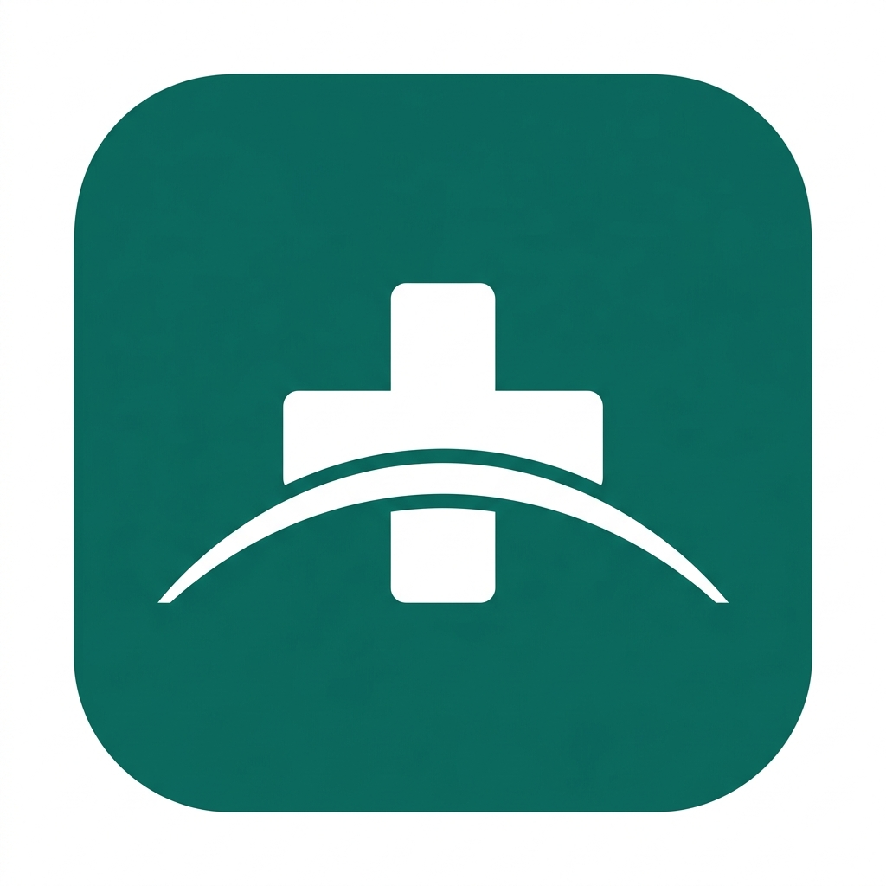

#  SwasthyaSetu

An offline-first, multilingual rural healthcare guidance and referral PWA. It intentionally provides education, emergency escalation, and explainable symptom safety rules—not disease diagnosis or treatment.

## Features

- **Multilingual:** English, Marathi, and Hindi interfaces.
- **Offline-First PWA:** Works entirely without internet after the first load via Service Workers.
- **AI Triage (TensorFlow.js):** In-browser neural network for symptom urgency classification.
- **Risk Assessment:** Clinical algorithms (CKD-EPI for Kidney Disease, FINDRISC for Diabetes).
- **Vitals Tracker:** Local, private tracking of BP, Sugar, Weight, and SpO2 with trend charts.
- **Voice Input:** Web Speech API for low-literacy users to speak symptoms.
- **Authentication:** Optional Google sign-in with Supabase PostgreSQL patient-history storage.
- **Interactive Tour:** Built-in automated demos and app tours for ASHA workers.

```powershell
npm install
npm run dev
```

Open `http://localhost:3001`. For an offline demo, open the application once while connected; the service worker caches visited pages and local assets.

## Enable Google login and patient history

1. Copy `.env.example` to `.env.local` and fill in the Google OAuth, Better Auth, and Supabase variables.
2. Add `http://localhost:3001/api/auth/callback/google` as an authorised redirect URI in Google Cloud.
3. Run `npx auth@latest migrate`, then run [`supabase/schema.sql`](supabase/schema.sql) in Supabase SQL Editor.
4. Set `NEXT_PUBLIC_AUTH_ENABLED=true` and restart the development server.

Patient-history requests are authorised server-side from the Better Auth session. The browser never receives the Postgres connection string.

## Before real-world use

- Replace all directory placeholders with verified local PHC, CHC, district hospital, and emergency contacts.
- Obtain a clinician review of every health-content item.
- Do not use the application as an emergency triage system or clinical diagnostic tool.
